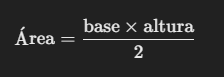

Ejercicio 1: Cálculo del área de un triángulo
Enunciado:
Imagina que estás creando una aplicación para calcular el área de un triángulo. El área de un triángulo se calcula con la fórmula:
​
 
La base del triángulo será 10 unidades.
La altura del triángulo será 5 unidades.
Tu tarea es crear un script en JavaScript que calcule el área utilizando los operadores matemáticos y mostrarlo en la consola.

Requisitos:

Usa operadores matemáticos para hacer la multiplicación y división.
Imprime en la consola el resultado del área del triángulo.